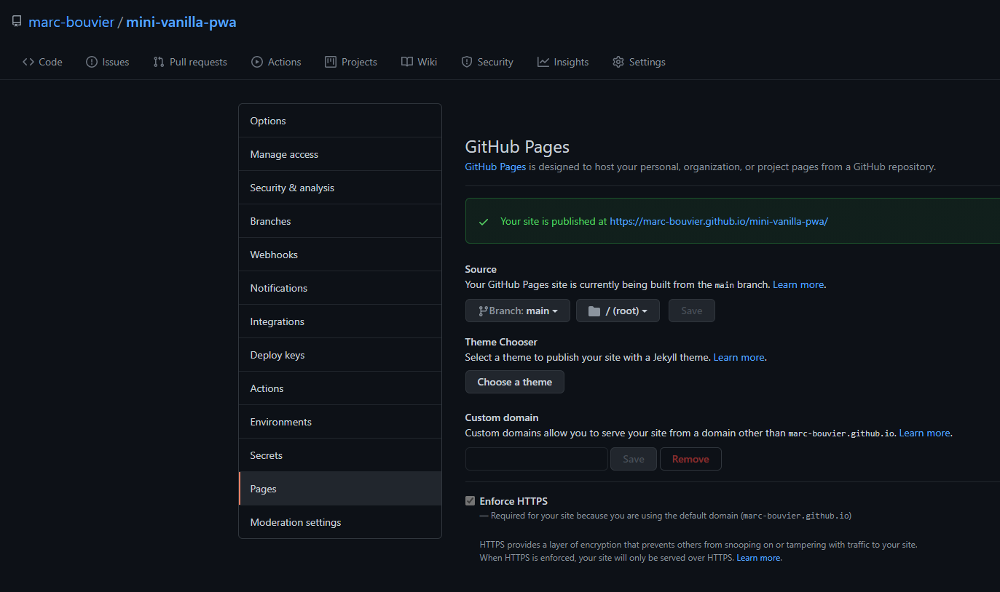
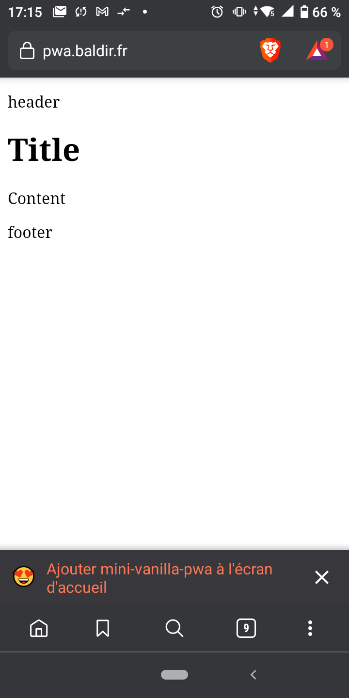
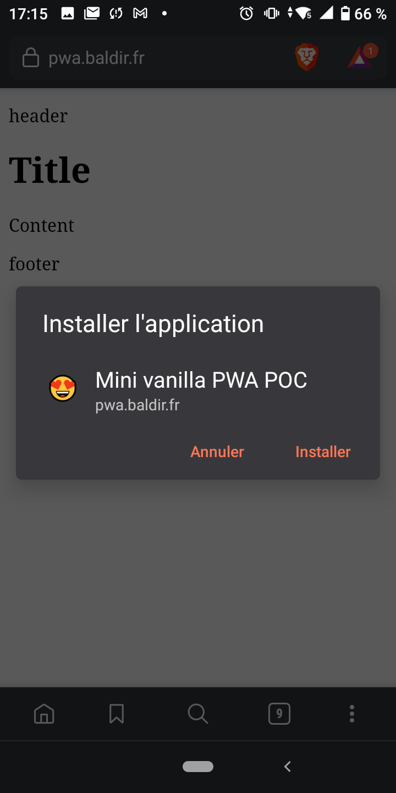
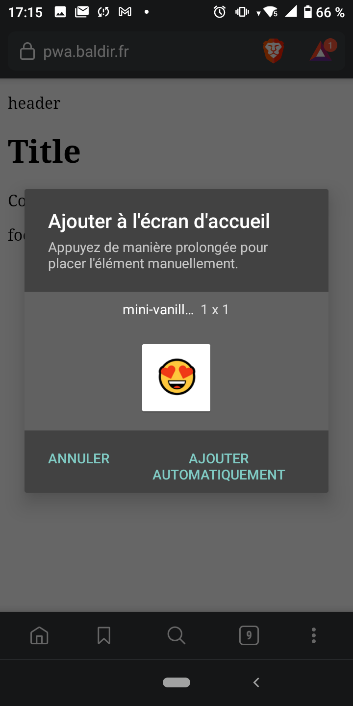
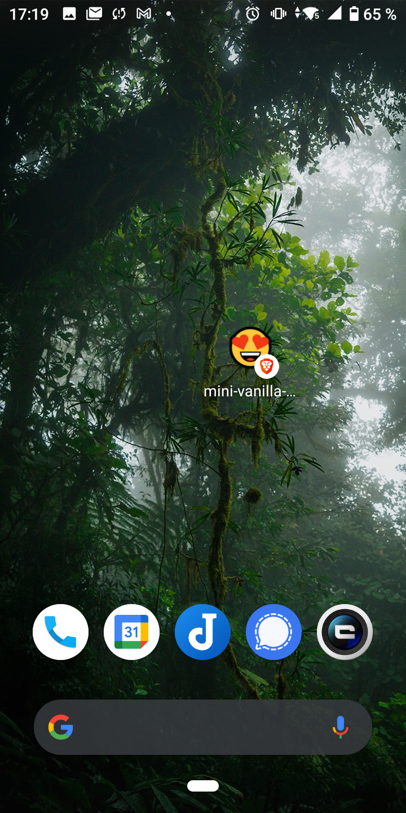

# mini-vanilla-pwa

POC of the most simple PWA (Progressive Web App) I can do.

## TODO

- [X] Find out what devices we want to target (https://caniuse.com/)
    - Most recent
- [X] Add subdomain `pwa.baldir.fr`
- [X] Create virtual host in my VPS (as a reverse proxy)
- [X] Create letsEncrypt certificate for the subdomain `pwa.baldir.fr`
- [X] add icons
- [X] Check PWA with LightHouse
- [X] Create and deploy to prove it can be installed on a device
- [ ] Document how to do it -> Making-of
- [ ] 404 error page `404.html`

## Installation

## Hosting

This sample is hosted as a github page for the sake of the example. You can try with you mobile to install the deployed application here : https://marc-bouvier.github.io/mini-vanilla-pwa/

## Architecture

- Hosting with https
- Domain

## Making-of (future blog post)

Initial setup

1. Setup a git repository
2. Choose a licence (I chose the https://unlicense.org) - See also https://choosealicense.com/

### First, what is a PWA?

See [MDN PWA definition][mdn-pwa-definition]

- A web page
- Native experience (for mobile users also)
- Classic URL
- What devices can support PWA?

### Hosting on a github page

Since this sample is only a static site we can host it on Github Pages and we don't have to have the hassle to buy a domain or install certificate.

Just activate github pages from this repo if you have forked it.

Here is a sample of the [github pages configuration](https://github.com/marc-bouvier/mini-vanilla-pwa/settings/pages) used in my github repository.



- Source
    - Branch : main
    - Folder : / (root)

### Hosting on a private server using Linode, Nginx and certbot

If you want to host the application on a real application server such as Nginx, you will need to obtain a domain and secure it with a certificate. 

#### Create a (sub-)domain

First you must own a domain name.

- `pwa.baldir.fr`
- Create A/AAAA Record for the IP address of your running web server (ex. Apache2, Nginx ... )
    - Hostname : pwa
    - Ip Address : the ip of your server
- Add a CAA record for letsencrypt.org and your domain
    - Name : pwa
    - Tag : issue
    - Value : letsencrypt.org

#### Create a virtual host

Then we need to redirect the (sub-)domain to the correct application in the running server.

Pre-requisites : install [nginx][nginx-website] & [certbot][certbot-website]

- Connect to your server through SSH
- Add a virtualhost to your nginx config

```
server {
    server_name  pwa.baldir.fr;

    root   /home/marc/sources/mini-vanilla-pwa;
    index  index.html index.htm;

    listen 80;
    listen [::]:80;
    
    location / {
       try_files $uri $uri/ =404;
    }

    error_page  404              /404.html;

    # redirect server error pages to the static page /50x.html
    #
    error_page   500 502 503 504  /50x.html;
    location = /50x.html {
        root   /usr/share/nginx/html;
    }

}
```

- use `sudo certbot` to add the certificate to your nginx sites

Here is a sample of the final Nginx configuration modified by certbot.

```
server {
    server_name  pwa.baldir.fr;

    root   /home/marc/sources/mini-vanilla-pwa;
    index  index.html index.htm;

    location / {
       try_files $uri $uri/ =404;
    }

    error_page  404              /404.html;

    # redirect server error pages to the static page /50x.html
    #
    error_page   500 502 503 504  /50x.html;
    location = /50x.html {
        root   /usr/share/nginx/html;
    }


    listen [::]:443 ssl; # managed by Certbot
    listen 443 ssl; # managed by Certbot
    ssl_certificate /etc/letsencrypt/live/baldir.fr/fullchain.pem; # managed by Certbot
    ssl_certificate_key /etc/letsencrypt/live/baldir.fr/privkey.pem; # managed by Certbot
    include /etc/letsencrypt/options-ssl-nginx.conf; # managed by Certbot
    ssl_dhparam /etc/letsencrypt/ssl-dhparams.pem; # managed by Certbot

}
server {
    if ($host = pwa.baldir.fr) {
        return 301 https://$host$request_uri;
    } # managed by Certbot


    server_name  pwa.baldir.fr;

    listen 80;
    listen [::]:80;
    return 404; # managed by Certbot
}
```

### `manifest.json`

- create a `manifest.json` file (for more information follow [the w3c spec][w3c-manifest-spec])
- reference it in a `<link rel="manifest" href="/manifest.json">`
- create icons (they are required)
- add support for older devices : `<link rel='icon' sizes='192x192' href='icon-192x192.png'>`

Ex. 

```json
{
    "lang": "en",
    "dir": "ltr",
    "name": "Mini vanilla PWA POC",
    "short_name": "mini-vanilla-pwa",
    "scope": "./",
    "icons": [{
        "src": "icons/icon_144x144.png",
        "sizes": "144x144",
        "type": "image/png"
    },
        {
            "src": "icons/icon_192x192.png",
            "sizes": "192x192",
            "type": "image/png"
        }],
    "display": "standalone",
    "start_url": "./"
}
```

### Add a service worker

index.html

```html
<!DOCTYPE html>
<html lang="en">
<head>
    <meta charset="utf-8">
    <title>Mini vanilla PWA POC</title>
    <meta name="description" content="POC of the most simple PWA (Progressive Web App) I can do.">
    <meta name="author" content="marc-bouvier">
    <meta name="theme-color" content="#B12A34">
    <meta name="viewport" content="width=device-width, initial-scale=1">
    <meta property="og:image" content="icons/icon_192x192.png">
<!--    <link rel="shortcut icon" href="favicon.ico">-->
    <link rel="stylesheet" href="style.css">
    <link rel="manifest" href="mini-vanilla-pwa.webmanifest">
<!--    <script src="data/games.js" defer></script>-->
    <script src="app.js" defer></script>
</head>
<body>
<header>
    <p>header</p>
</header>
<main>
    <h1>Title</h1>
    <p>Content</p>
</main>
<footer>
    <p>footer</p>
</footer>
</body>
</html>
```
app.js

```js
// Register service worker
if('serviceWorker' in navigator) {
    navigator.serviceWorker.register('/sw.js');
};
```

sw.js

```js

var cacheName = 'mini-vanilla-pwa-v1';
var appShellFiles = [
    '/',
    '/index.html',
    '/app.js',
    '/style.css',
    // '/favicon.ico',
    '/icons/icon_144x144.png',
    '/icons/icon_192x192.png',
];
var contentToCache =appShellFiles;

// Install the assets for local use

self.addEventListener('install', function(e) {
    console.log('[Service Worker] Install');
    e.waitUntil(
        caches.open(cacheName).then(function(cache) {
            console.log('[Service Worker] Caching all: app shell and content');
            return cache.addAll(contentToCache);
        })
    );
});

// Bypass fetch to load installed assets instead of live ones

self.addEventListener('fetch', function(e) {
    e.respondWith(
        caches.match(e.request).then(function(r) {
            console.log('[Service Worker] Fetching resource: '+e.request.url);
            return r || fetch(e.request).then(function(response) {
                return caches.open(cacheName).then(function(cache) {
                    console.log('[Service Worker] Caching new resource: '+e.request.url);
                    cache.put(e.request, response.clone());
                    return response;
                });
            });
        })
    );
});
```
### Add the application to your mobile phone

Now, you should be able to install the application when you open it (https://marc-bouvier.github.io/mini-vanilla-pwa) from your device browser.










The application will open in full screen using the browser from which you installed it.

[w3c-manifest-spec]:https://w3c.github.io/manifest/
[mdn-pwa-definition]:https://developer.mozilla.org/fr/docs/Web/Progressive_web_apps/App_structure
[nginx-website]:https://www.nginx.com/
[certbot-website]:https://certbot.eff.org/